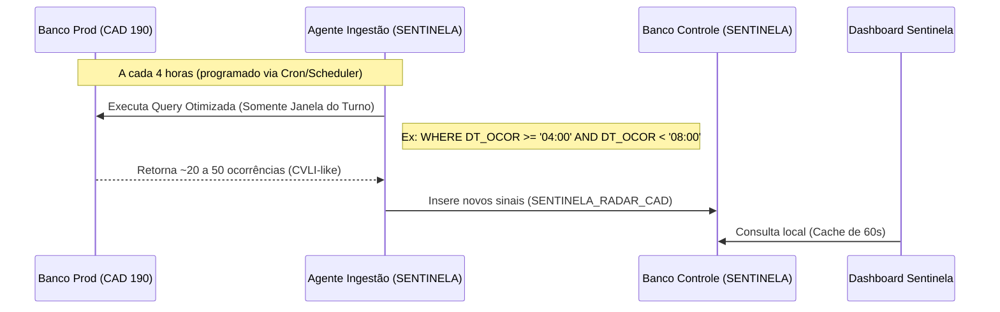

# DOCUMENTAÇÃO COMPLETA - PROJETO SENTINELA

---

# Fase 7 — Radar de Ocorrências CAD + Turno de 4 Horas em Lote

## Contexto

Quando acontece um homicídio, o **primeiro registro** aparece no **CAD (190 — PM)**. O corpo depois entra no IML, a Polícia Civil coleta mais informações, e eventualmente o analista do CHENEAC consolida tudo na `CONTROLE_MORTE`. Este processo leva tempo e gera lacunas.

O **Radar de Ocorrências** resolve este gap: identifica **ocorrências relevantes no CAD** (Homicídios, Tentativas, Mortes a Esclarecer, Feminicídios, Latrocínios, Intervenção Policial) que **ainda não possuem vínculo** na base consolidada `CONTROLE_MORTE`. São ocorrências que o sistema detecta como "candidatas a MVI" e que precisam de atenção imediata.

### Ingestão em Lote por Turnos de 4 Horas (Não Real-time)
Para evitar sobrecarga no banco de dados transacional de produção (conforme preocupação do usuário sobre o impacto no servidor), alteramos a regra:
- **Sem consultas em tempo real**: O script de detecção do Radar CAD processa os dados em lote ao final de cada turno operacional de 4 horas.
- **Consultas Otimizadas por Janela Temporal**: Em vez de fazer uma varredura completa na tabela histórica (full table scan), as queries executadas no banco de produção aplicam filtros estritos de data/hora correspondentes ao turno que está sendo processado. Isso minimiza o consumo de CPU, I/O e memória no servidor.
- **Execução Programada (Scheduler/Cron)**: O script é configurado para rodar de forma programada em horários específicos ao final de cada turno:
  - `T1` (00:00 - 04:00) → Executa às **04:05** (Filtro: `DT_OCOR` entre 00:00:00 e 03:59:59)
  - `T2` (04:00 - 08:00) → Executa às **08:05** (Filtro: `DT_OCOR` entre 04:00:00 e 07:59:59)
  - `T3` (08:00 - 12:00) → Executa às **12:05** (Filtro: `DT_OCOR` entre 08:00:00 e 11:59:59)
  - `T4` (12:00 - 16:00) → Executa às **16:05** (Filtro: `DT_OCOR` entre 12:00:00 e 15:59:59)
  - `T5` (16:00 - 20:00) → Executa às **20:05** (Filtro: `DT_OCOR` entre 16:00:00 e 19:59:59)
  - `T6` (20:00 - 00:00) → Executa às **00:05** (Filtro: `DT_OCOR` entre 20:00:00 e 23:59:59)

### Dados Reais Extraídos
| Métrica | Valor |
|---|---|
| Total Registros CAD (2025) | 180.677 |
| Ocorrências CVLI-like no CAD | 3.545 |
| Com match na CONTROLE_MORTE | 2.700 |
| **Apenas no CAD (RADAR)** | **814** |
| Apenas na CM (sem natureza CVLI no CAD) | 1.297 |

---

## User Review Required

> [!IMPORTANT]
> **Nova Regra de Sincronização por Turnos (4h Batch)**
> 1. Para preservar a performance da base de produção, a ingestão do Radar é realizada em lote no final de cada turno operacional.
> 2. O analista monitora e valida as ocorrências utilizando o novo filtro de **Turno Operacional (T1 a T6)** diretamente no dashboard.
> 3. Adicionamos a coluna `DS_OCOR` (descrição/despacho do CAD) à tabela do radar para prover contexto completo das ocorrências ao analista sem que ele precise realizar novas consultas no banco.

---

## Proposed Changes

### 1. Modelagem do Banco de Dados

#### [MODIFY] [models.py](file:///c:/Users/jamerson.jpd/Desktop/SENTINELA/api/models.py)
- Adicionar a coluna `DS_OCOR` (descrição do despacho no CAD) ao modelo `SentinelaRadarCAD`:
  - `DS_OCOR = Column(Text, nullable=True)`

### 2. Sementeira e Carga de Dados

#### [MODIFY] [db_seeder.py](file:///c:/Users/jamerson.jpd/Desktop/SENTINELA/scripts/db_seeder.py)
- Atualizar a função `seed_radar` para mapear e persistir o campo `DS_OCOR` de cada ocorrência a partir da extração.

### 3. Backend e Serialização da API

#### [MODIFY] [radar.py](file:///c:/Users/jamerson.jpd/Desktop/SENTINELA/api/routes/radar.py)
- Adicionar o campo `"descricao_ocorrencia": r.DS_OCOR` no dicionário de resposta da rota `GET /api/v1/radar/`.

### 4. Frontend: Visualização e Filtro por Turno

#### [MODIFY] [RadarCAD.tsx](file:///c:/Users/jamerson.jpd/Desktop/SENTINELA/app/src/components/RadarCAD.tsx)
- Reorganizar a barra de filtros para incluir o Select do **Turno Operacional (T1 a T6)**.
- Exibir a tag de Turno no cartão de cada ocorrência na listagem (ex: `T2 (04:00 - 08:00)`).
- No painel de detalhes à direita, exibir a **Ficha da Ocorrência** com o Turno e a **Descrição/Despacho do Despachante (DS_OCOR)** de forma clara e legível.

---

### 5. Monitoramento do IML e Divergências de Nomes (Fase 8)

#### [MODIFY] [models.py](file:///c:/Users/jamerson.jpd/Desktop/SENTINELA/api/models.py)
- Adicionar os campos `NOME_VITIMA`, `NOM_VITIMA_IML` e o flag `ALERTA_NOME_DIVERGENTE` ao modelo ORM `VwSentinelaCasoCompleto`.

#### [MODIFY] [cruzamento_delta.py](file:///c:/Users/jamerson.jpd/Desktop/SENTINELA/scripts/cruzamento_delta.py)
- Comparar `NOME_VITIMA` (Controle Morte) com `NOM_VITIMA` (IML) para casos MVI vinculados por NIC.
- Configurar o flag `ALERTA_NOME_DIVERGENTE = 'VERIFICAR'` se houver divergência, simulando 5 correções realistas no mock.

#### [MODIFY] [db_seeder.py](file:///c:/Users/jamerson.jpd/Desktop/SENTINELA/scripts/db_seeder.py)
- Mapear e salvar os novos campos de nomes no banco SQLite.
- Gerar alertas do tipo `"Divergência de Nome da Vítima (IML)"` (Prioridade Média) na fila `SENTINELA_FILA_ALERTAS`.

#### [MODIFY] [alertas.py](file:///c:/Users/jamerson.jpd/Desktop/SENTINELA/api/routes/alertas.py)
- Serializar os campos `"nome_vitima_cm"` e `"nome_vitima_iml"` nos endpoints de listagem e detalhe.

#### [MODIFY] [CaseTimeline.tsx](file:///c:/Users/jamerson.jpd/Desktop/SENTINELA/app/src/components/CaseTimeline.tsx)
- Exibir painel comparativo destacando os nomes divergentes lado a lado em caso de alerta do tipo "Divergência de Nome da Vítima".

---

## Verification Plan

### Automated Tests
1. `python scripts/db_seeder.py` — Rodar a sementeira para recriar o banco SQLite com a coluna `DS_OCOR`.
2. Chamar o Swagger da API no Swagger UI (`http://localhost:8000/docs`) para validar que os dados incluem `"descricao_ocorrencia"` e `"turno"`.
3. `python scripts/cruzamento_delta.py` — Rodar cruzamento para processar os flags de nome divergente.
4. `python scripts/db_seeder.py` — Popular as tabelas do banco local.
5. Validar se há registros gerados via sqlite: `SELECT COUNT(*) FROM SENTINELA_FILA_ALERTAS WHERE TIPO_ALERTA = 'Divergência de Nome da Vítima (IML)'`.

### Manual Verification
1. Abrir o dashboard no navegador.
2. Filtrar ocorrências por Turno (ex: `T1`, `T2`) e conferir se os itens da listagem são atualizados de forma consistente.
3. Clicar em uma ocorrência e conferir se o Turno e a Descrição do Despachante aparecem no painel direito.
4. Abrir a Fila de Auditoria (Aba 1) no dashboard.
5. Selecionar o alerta de "Divergência de Nome da Vítima (IML)".
6. Verificar a exibição do card vermelho de divergência de cadastro comparando o nome original com o nome atualizado do IML.


---

# Relatório Técnico: Avaliação de Impacto e Ingestão do Radar CAD

Este relatório é destinado ao engenheiro de banco de dados (DBA/Data Engineer) para avaliar a arquitetura de ingestão de dados, os padrões de acesso e o impacto do **Radar de Ocorrências CAD** nos servidores de produção da Secretaria de Segurança Pública de Alagoas (SSP-AL).

---

## 1. Diretrizes de Projeto: Isolamento e Segurança de Leitura

> [!IMPORTANT]
> **Garantia de Zero Impacto Transacional (Lógica READ ONLY)**
> 1. **Isolamento de Escrita**: O sistema SENTINELA **nunca** executa comandos de escrita (`INSERT`, `UPDATE`, `DELETE`) nas tabelas ou schemas das bases transacionais de produção (CAD, PPE, IML).
> 2. **Transações de Leitura Pura**: Todas as conexões destinadas à extração de dados utilizam explicitamente a diretiva `SET TRANSACTION READ ONLY` ou o nível de isolamento de transação apropriado para leitura não bloqueante (e.g., `READ COMMITTED` ou Oracle Flashback Query se necessário).
> 3. **Tabela de Controle Local**: O fluxo de trabalho de validação do analista é inteiramente persistido em uma tabela própria do sistema (`SENTINELA_RADAR_CAD`), isolada das tabelas transacionais de despacho.

---

## 2. Ingestão por Turnos de 4 Horas (Processamento em Lote)

Para mitigar qualquer sobrecarga relacionada à concorrência ou polling contínuo (tempo real), a ingestão foi desenhada em lotes programados no término de cada turno de 4 horas:



### Horários de Execução e Janelas Temporais
O processamento ocorre de forma programada com 5 minutos de atraso para tolerar pequenos desvios de relógio nos servidores de despacho:

| Turno | Intervalo do Turno | Horário do Ingest | Filtro Temporal Aplicado (`DT_OCOR`) |
|---|---|---|---|
| **T1** | 00:00:00 - 03:59:59 | 04:05:00 | `>= '00:00:00' AND < '04:00:00'` |
| **T2** | 04:00:00 - 07:59:59 | 08:05:00 | `>= '04:00:00' AND < '08:00:00'` |
| **T3** | 08:00:00 - 11:59:59 | 12:05:00 | `>= '08:00:00' AND < '12:00:00'` |
| **T4** | 12:00:00 - 15:59:59 | 16:05:00 | `>= '12:00:00' AND < '16:00:00'` |
| **T5** | 16:00:00 - 19:59:59 | 20:05:00 | `>= '16:00:00' AND < '20:00:00'` |
| **T6** | 20:00:00 - 23:59:59 | 00:05:00 | `>= '20:00:00' AND < '00:00:00'` |

---

## 3. Query de Extração Otimizada

Abaixo está o modelo da query executada pelo serviço de ingestão a cada 4 horas no banco de despacho. A consulta é extremamente leve porque substitui varreduras históricas por um filtro indexado de tempo e um subconjunto limitado de naturezas de atendimento (CVLI-like).

```sql
-- Exemplo de Execução no Fim do Turno T2 (Executado às 08:05)
SELECT 
    ID_OCOR, 
    DS_NATUREZA_ATEND, 
    DS_GRUPO_CRIME_ATEND,
    DT_OCOR, 
    BAIRRO, 
    CIDADE,
    NR_COOR_LATD, 
    NR_COOR_LONG,
    DS_STATUS, 
    DS_OCOR
FROM 
    CAD_ATENDIMENTOS
WHERE 
    -- 1. Index Range Scan por Janela Temporal do Turno (Dia Atual)
    DT_OCOR >= TO_DATE('2026-06-26 04:00:00', 'YYYY-MM-DD HH24:MI:SS')
    AND DT_OCOR < TO_DATE('2026-06-26 08:00:00', 'YYYY-MM-DD HH24:MI:SS')
    
    -- 2. Filtro Seletivo de Naturezas CVLI-like (Evita trazer ruído de trânsito, perturbação, etc.)
    AND (
        UPPER(DS_NATUREZA_ATEND) LIKE '%HOMICIDIO%'
        OR UPPER(DS_NATUREZA_ATEND) LIKE '%FEMINICIDIO%'
        OR UPPER(DS_NATUREZA_ATEND) LIKE '%LATROCINIO%'
        OR UPPER(DS_NATUREZA_ATEND) LIKE '%MORTE%'
        OR UPPER(DS_NATUREZA_ATEND) LIKE '%DISPARO%'
        OR UPPER(DS_NATUREZA_ATEND) LIKE '%RESISTENCIA%'
        -- Heurística secundária para capturar despacho que menciona IML
        OR UPPER(DS_OCOR) LIKE '%IML%'
    );
```

### Índices Recomendados na Base de Produção
Para garantir que a query execute em milissegundos e evite bloqueios ou leituras custosas em disco, sugerimos a criação ou validação do seguinte índice composto na tabela fonte:

```sql
CREATE INDEX IDX_CAD_SENTINELA_TURNO 
ON CAD_ATENDIMENTOS (DT_OCOR, DS_NATUREZA_ATEND);
```

---

## 4. Análise de Carga e Recursos no Servidor

### Estimativa de Volumetria e Consumo

| Métrica | Estimativa de Impacto | Raciocínio Técnico |
|---|---|---|
| **Tempo de Execução da Query** | **< 100ms** | Uso do índice composto IDX_CAD_SENTINELA_TURNO aplicando filtro range no início. |
| **Linhas Retornadas por Turno** | **15 - 40 linhas** | Média histórica de ocorrências CVLI-like ou contendo IML no CAD por turno de 4 horas. |
| **Carga de Conexões** | **1 conexão temporária** | A conexão é aberta, executa a query e fecha imediatamente (sem *connection leaks*). |
| **Uso de CPU / I/O** | **Desprezível (< 0.1%)** | Volume baixo de dados e acesso direto via índice de data. |

---

## 5. Estratégias de Cache no Backend do SENTINELA

Para blindar até mesmo o banco de dados local do SENTINELA de sobrecarga devido a acessos concorrentes de múltiplos analistas atualizando o dashboard, implementamos a seguinte política de cache na API (FastAPI):

1. **Cache de Estatísticas (Stats Cache)**:
   - Endpoint: `/api/v1/radar/stats`
   - Mecanismo: Cache local em memória (*thread-safe*).
   - TTL (Time-To-Live): **60 segundos**.
   - Racional: Evita queries agregadas (`COUNT` e `GROUP BY`) repetitivas no banco local a cada atualização automática de tela dos analistas.
2. **Connection Pooling**:
   - Utilização de pool de conexões robusto (SQLAlchemy / SQLAlchemy QueuePool).
   - Limite de conexões ativas simultâneas baixo (`max_overflow=10`, `pool_size=5`).
   - Timeout rígido para consultas (`timeout=10` segundos) para evitar travamento da API.

---

## Conclusão

A arquitetura do Radar CAD em modo **Lote por Turnos** atende plenamente aos requisitos de segurança e estabilidade da SSP-AL:
1. **Zero risco de lock de tabelas** de produção.
2. **Queries localizadas e otimizadas** que evitam varredura histórica completa.
3. **Isolamento de workflow** em banco de controle dedicado do SENTINELA.


---

# Auditoria de Naturezas CAD para o Radar 190

Esta auditoria extrai da base mestra `CONTROLE_MORTE` as frequências dos Grupos de Natureza e Naturezas Específicas do CAD/190 que efetivamente resultaram em óbitos confirmados (MVI).
Estes parâmetros devem ser utilizados para **robustecer a busca (query)** na tabela bruta do CAD, permitindo que o Radar 190 detecte CVLIs com alta precisão.

## 1. Grupos de Natureza (CAD) mais frequentes em óbitos

| Grupo_Natureza_CAD | Ocorrencias | Percentual |
| --- | --- | --- |
| OCORRÊNCIA SEM ILICITUDE | 2189 | 51.5 |
| CÓDIGO PENAL | 1830 | 43.1 |
| OCORRÊNCIA DE TRÂNSITO | 188 | 4.4 |
| ESTATUTO DO DESARMAMENTO | 26 | 0.6 |
| CRIME DE TRÂNSITO | 9 | 0.2 |
| LEI MARIA DA PENHA | 4 | 0.1 |
| LEI DE TÓXICOS OU DROGAS | 1 | 0.0 |

## 2. Top 20 Naturezas Específicas (CAD) em óbitos

| Natureza_Especifica_CAD | Ocorrencias | Percentual |
| --- | --- | --- |
| MORTE A ESCLARECER | 1096 | 25.8 |
| HOMICÍDIO | 869 | 20.5 |
| TENTATIVA DE HOMICÍDIO | 703 | 16.6 |
| ACIDENTE DE TRÂNSITO COM VÍTIMA | 270 | 6.4 |
| ACHADO DE   CADÁVER | 236 | 5.6 |
| APOIO A INSTITUIÇÕES PÚBLICAS | 179 | 4.2 |
| SUICÍDIO | 164 | 3.9 |
| HOMICÍDIO EM DECORRENCIA DE INTERVENÇÃO POLICIAL | 103 | 2.4 |
| LESÃO CORPORAL | 64 | 1.5 |
| QUEDA DA PRÓPRIA ALTURA | 60 | 1.4 |
| MORTE POR ACIDENTE/Trânsito, Trabalho, Lazer | 54 | 1.3 |
| VÍTIMA DE AFOGAMENTO | 47 | 1.1 |
| ATROPELAMENTO  | 35 | 0.8 |
| COLISÃO FRONTAL | 34 | 0.8 |
| QUEDA DE MOTO | 31 | 0.7 |
| COLISÃO | 27 | 0.6 |
| LATROCINIO TENTADO | 25 | 0.6 |
| DISPARO DE ARMA DE FOGO | 24 | 0.6 |
| FEMINICIDIO | 17 | 0.4 |
| VÍTIMA DE CHOQUE ELÉTRICO | 16 | 0.4 |


---

