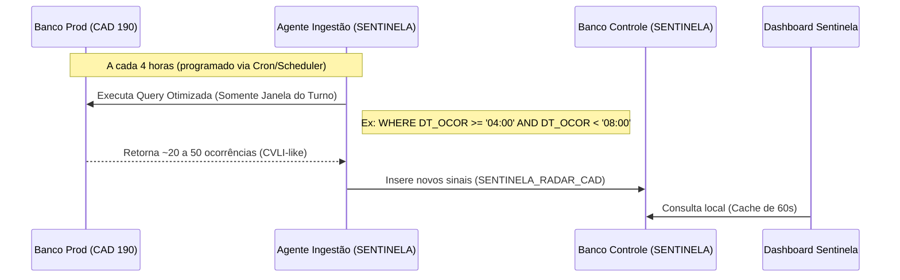

# Relatório Técnico: Avaliação de Impacto e Ingestão do Radar CAD

Este relatório é destinado ao engenheiro de banco de dados (DBA/Data Engineer) para avaliar a arquitetura de ingestão de dados, os padrões de acesso e o impacto do **Radar de Ocorrências CAD** nos servidores de produção da Secretaria de Segurança Pública de Alagoas (SSP-AL).

---

## 1. Diretrizes de Projeto: Isolamento e Segurança de Leitura

> [!IMPORTANT]
> **Garantia de Zero Impacto Transacional (Lógica READ ONLY)**
> 1. **Isolamento de Escrita**: O sistema SENTINELA **nunca** executa comandos de escrita (`INSERT`, `UPDATE`, `DELETE`) nas tabelas ou schemas das bases transacionais de produção (CAD, PPE, IML).
> 2. **Transações de Leitura Pura**: Todas as conexões destinadas à extração de dados utilizam explicitamente a diretiva `SET TRANSACTION READ ONLY` ou o nível de isolamento de transação apropriado para leitura não bloqueante (e.g., `READ COMMITTED` ou Oracle Flashback Query se necessário).
> 3. **Tabela de Controle Local**: O fluxo de trabalho de validação do analista é inteiramente persistido em uma tabela própria do sistema (`SENTINELA_RADAR_CAD`), isolada das tabelas transacionais de despacho.

---

## 2. Ingestão por Turnos de 4 Horas (Processamento em Lote)

Para mitigar qualquer sobrecarga relacionada à concorrência ou polling contínuo (tempo real), a ingestão foi desenhada em lotes programados no término de cada turno de 4 horas:



### Horários de Execução e Janelas Temporais
O processamento ocorre de forma programada com 5 minutos de atraso para tolerar pequenos desvios de relógio nos servidores de despacho:

| Turno | Intervalo do Turno | Horário do Ingest | Filtro Temporal Aplicado (`DT_OCOR`) |
|---|---|---|---|
| **T1** | 00:00:00 - 03:59:59 | 04:05:00 | `>= '00:00:00' AND < '04:00:00'` |
| **T2** | 04:00:00 - 07:59:59 | 08:05:00 | `>= '04:00:00' AND < '08:00:00'` |
| **T3** | 08:00:00 - 11:59:59 | 12:05:00 | `>= '08:00:00' AND < '12:00:00'` |
| **T4** | 12:00:00 - 15:59:59 | 16:05:00 | `>= '12:00:00' AND < '16:00:00'` |
| **T5** | 16:00:00 - 19:59:59 | 20:05:00 | `>= '16:00:00' AND < '20:00:00'` |
| **T6** | 20:00:00 - 23:59:59 | 00:05:00 | `>= '20:00:00' AND < '00:00:00'` |

---

## 3. Query de Extração Otimizada

Abaixo está o modelo da query executada pelo serviço de ingestão a cada 4 horas no banco de despacho. A consulta é extremamente leve porque substitui varreduras históricas por um filtro indexado de tempo e um subconjunto limitado de naturezas de atendimento (CVLI-like).

```sql
-- Exemplo de Execução no Fim do Turno T2 (Executado às 08:05)
SELECT 
    ID_OCOR, 
    DS_NATUREZA_ATEND, 
    DS_GRUPO_CRIME_ATEND,
    DT_OCOR, 
    BAIRRO, 
    CIDADE,
    NR_COOR_LATD, 
    NR_COOR_LONG,
    DS_STATUS, 
    DS_OCOR
FROM 
    CAD_ATENDIMENTOS
WHERE 
    -- 1. Index Range Scan por Janela Temporal do Turno (Dia Atual)
    DT_OCOR >= TO_DATE('2026-06-26 04:00:00', 'YYYY-MM-DD HH24:MI:SS')
    AND DT_OCOR < TO_DATE('2026-06-26 08:00:00', 'YYYY-MM-DD HH24:MI:SS')
    
    -- 2. Filtro Seletivo de Naturezas CVLI-like (Evita trazer ruído de trânsito, perturbação, etc.)
    AND (
        UPPER(DS_NATUREZA_ATEND) LIKE '%HOMICIDIO%'
        OR UPPER(DS_NATUREZA_ATEND) LIKE '%FEMINICIDIO%'
        OR UPPER(DS_NATUREZA_ATEND) LIKE '%LATROCINIO%'
        OR UPPER(DS_NATUREZA_ATEND) LIKE '%MORTE%'
        OR UPPER(DS_NATUREZA_ATEND) LIKE '%DISPARO%'
        OR UPPER(DS_NATUREZA_ATEND) LIKE '%RESISTENCIA%'
        -- Heurística secundária para capturar despacho que menciona IML
        OR UPPER(DS_OCOR) LIKE '%IML%'
    );
```

### Índices Recomendados na Base de Produção
Para garantir que a query execute em milissegundos e evite bloqueios ou leituras custosas em disco, sugerimos a criação ou validação do seguinte índice composto na tabela fonte:

```sql
CREATE INDEX IDX_CAD_SENTINELA_TURNO 
ON CAD_ATENDIMENTOS (DT_OCOR, DS_NATUREZA_ATEND);
```

---

## 4. Análise de Carga e Recursos no Servidor

### Estimativa de Volumetria e Consumo

| Métrica | Estimativa de Impacto | Raciocínio Técnico |
|---|---|---|
| **Tempo de Execução da Query** | **< 100ms** | Uso do índice composto IDX_CAD_SENTINELA_TURNO aplicando filtro range no início. |
| **Linhas Retornadas por Turno** | **15 - 40 linhas** | Média histórica de ocorrências CVLI-like ou contendo IML no CAD por turno de 4 horas. |
| **Carga de Conexões** | **1 conexão temporária** | A conexão é aberta, executa a query e fecha imediatamente (sem *connection leaks*). |
| **Uso de CPU / I/O** | **Desprezível (< 0.1%)** | Volume baixo de dados e acesso direto via índice de data. |

---

## 5. Estratégias de Cache no Backend do SENTINELA

Para blindar até mesmo o banco de dados local do SENTINELA de sobrecarga devido a acessos concorrentes de múltiplos analistas atualizando o dashboard, implementamos a seguinte política de cache na API (FastAPI):

1. **Cache de Estatísticas (Stats Cache)**:
   - Endpoint: `/api/v1/radar/stats`
   - Mecanismo: Cache local em memória (*thread-safe*).
   - TTL (Time-To-Live): **60 segundos**.
   - Racional: Evita queries agregadas (`COUNT` e `GROUP BY`) repetitivas no banco local a cada atualização automática de tela dos analistas.
2. **Connection Pooling**:
   - Utilização de pool de conexões robusto (SQLAlchemy / SQLAlchemy QueuePool).
   - Limite de conexões ativas simultâneas baixo (`max_overflow=10`, `pool_size=5`).
   - Timeout rígido para consultas (`timeout=10` segundos) para evitar travamento da API.

---

## Conclusão

A arquitetura do Radar CAD em modo **Lote por Turnos** atende plenamente aos requisitos de segurança e estabilidade da SSP-AL:
1. **Zero risco de lock de tabelas** de produção.
2. **Queries localizadas e otimizadas** que evitam varredura histórica completa.
3. **Isolamento de workflow** em banco de controle dedicado do SENTINELA.
