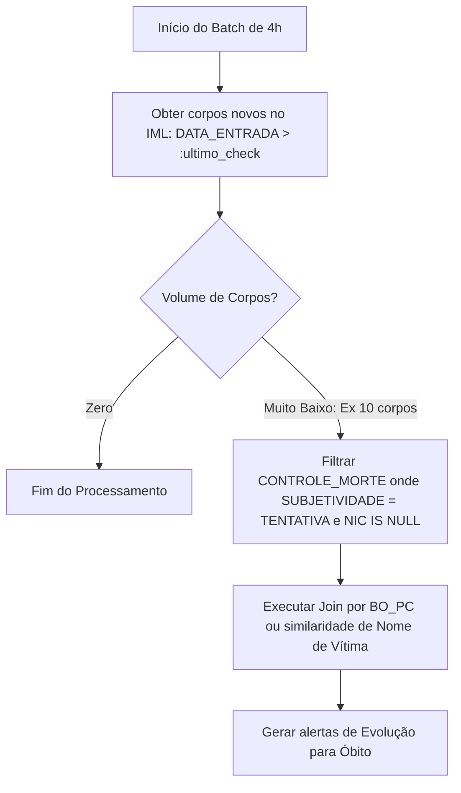

# Otimização de Cruzamento: Evolução de Tentativa para Óbito (Evolução de Casos)

Este documento detalha o desafio técnico e a estratégia de otimização de banco de dados para rastrear **"Evolução para Óbito"** no Projeto SENTINELA. Este é o cenário onde uma vítima de tentativa de homicídio ou lesão corporal grave registrada no passado (dias, meses ou anos atrás) falece no hospital, gerando um registro de óbito recente no IML.

---

## 1. O Desafio Técnico: A Abordagem Ineficiente (*Naive*)

Rastrear tentativas antigas cruzando com registros do IML de forma ingênua causaria degradação severa de performance:

```sql
-- ❌ ABORDAGEM INEFICIENTE (Cartesian Product / Full Table Scan)
SELECT CM.ID_CONTROLE_MORTE, IML.NIC
FROM NEAC.CONTROLE_MORTE CM
JOIN SGOU.VIEW_IML_NEAC_CADAVERICO IML 
  ON (CM.BO_PC = IML.DELEGADO_REQUERENTE 
      OR UTL_MATCH.JARO_WINKLER_SIMILARITY(CM.NOME_VITIMA, IML.NOM_VITIMA) > 85)
WHERE CM.SUBJETIVIDADE LIKE '%TENTATIVA%'
  AND CM.NIC IS NULL;
```
### Por que essa query falha em produção?
1. **Varredura Completa**: A query precisa varrer *todas* as tentativas históricas e calcular a similaridade de strings (Jaro-Winkler) contra *todos* os corpos do IML. O cálculo de similaridade é extremamente caro para a CPU.
2. **Crescimento Exponencial**: Conforme o tempo passa, o volume de tentativas históricas cresce, tornando a query cada vez mais lenta.

---

## 2. A Solução: Estratégia de "Delta Invertido" (Inverted Delta)

Em vez de buscar "quais tentativas do passado morreram hoje", a busca é invertida: **"quais corpos que deram entrada no IML recentemente correspondem a alguma tentativa registrada no passado?"**

Como a entrada do corpo no IML é um evento recente e datado, podemos usar a janela de tempo do turno de execução para filtrar o conjunto de dados ativo a um volume mínimo (geralmente de 5 a 15 registros por lote).



---

## 3. Query Otimizada de Evolução

Abaixo está o modelo da query implementada no agente `ChangeDetector`, otimizada para usar a janela de controle do sincronizador (`:last_check_time`):

```sql
-- ✅ ABORDAGEM OTIMIZADA (Leitura indexada guiada pelo Delta do IML)
SELECT 
    CM.ID_CONTROLE_MORTE, 
    IML.NIC AS NOVO_NIC, 
    CM.BO_PC, 
    CM.NOME_VITIMA, 
    IML.DAT_OBITO,
    IML.DATA_ENTRADA
FROM 
    SGOU.VIEW_IML_NEAC_CADAVERICO IML
JOIN 
    NEAC.CONTROLE_MORTE CM 
    ON (
        -- Filtro 1: Chave exata indexada (BO)
        CM.BO_PC = IML.DELEGADO_REQUERENTE 
        
        -- Filtro 2: Fuzzy match refinado por índice fonético ou Jaro-Winkler
        OR (
            -- Primeiro valida se as iniciais batem antes de rodar o Jaro-Winkler (salva CPU)
            SUBSTR(CM.NOME_VITIMA, 1, 1) = SUBSTR(IML.NOM_VITIMA, 1, 1)
            AND UTL_MATCH.JARO_WINKLER_SIMILARITY(UPPER(CM.NOME_VITIMA), UPPER(IML.NOM_VITIMA)) > 88
        )
    )
WHERE 
    -- 1. Delta estrito guiado pela data de entrada do IML (filtra apenas corpos do turno)
    IML.DATA_ENTRADA > :last_check_time
    
    -- 2. Busca apenas tentativas sem NIC associado
    AND CM.SUBJETIVIDADE LIKE '%TENTATIVA%'
    AND CM.NIC IS NULL;
```

---

## 4. Otimizações de Banco de Dados Adicionais

Para garantir a execução em milissegundos mesmo com buscas fonéticas/fuzzy, recomendamos as seguintes estruturas no banco do cliente:

### A. Índices de Busca Rápida
1. **Índice no Delta do IML**:
   ```sql
   CREATE INDEX IDX_IML_DATA_ENTRADA ON SGOU.VIEW_IML_NEAC_CADAVERICO (DATA_ENTRADA, NIC);
   ```
2. **Índice nas Tentativas Pendentes**:
   ```sql
   CREATE INDEX IDX_CM_TENTATIVAS ON NEAC.CONTROLE_MORTE (SUBJETIVIDADE, NIC) 
   WHERE SUBJETIVIDADE LIKE '%TENTATIVA%' AND NIC IS NULL;
   ```

### B. Otimização Fonética (Evitando Jaro-Winkler Completo)
Em vez de calcular Jaro-Winkler para strings aleatórias, armazene o código fonético (como Soundex ou Metaphone adaptado para o Português) do nome da vítima na tabela `CONTROLE_MORTE` e no `IML`. O join pode ser feito primeiro pelo código fonético (que usa busca por igualdade indexada simples) e, apenas em caso de match, refinar com Jaro-Winkler.

```sql
-- Exemplo de Join Fonético
ON SOUNDEX(CM.NOME_VITIMA) = SOUNDEX(IML.NOM_VITIMA)
```

---

## 5. Workflow de Atualização no SENTINELA

Quando a query de "Delta Invertido" detecta uma evolução:
1. **Desparo do Alerta**: O agente insere um registro na tabela `SENTINELA_FILA_ALERTAS` com o tipo `Evolução de Tentativa para Óbito`.
2. **Ação do Analista**: O analista revisa os detalhes e clica em **"Validar"**.
3. **Escrita Segura**: A API executa a consolidação:
   - Vincula o `NIC` do óbito ao caso mestra em `CONTROLE_MORTE`.
   - Altera a classificação do caso de `TENTATIVA` para `CVLI_CONSUMADO` (Homicídio).
   - O caso passa a ser contabilizado automaticamente nos KPIs de homicídios da SSP.
